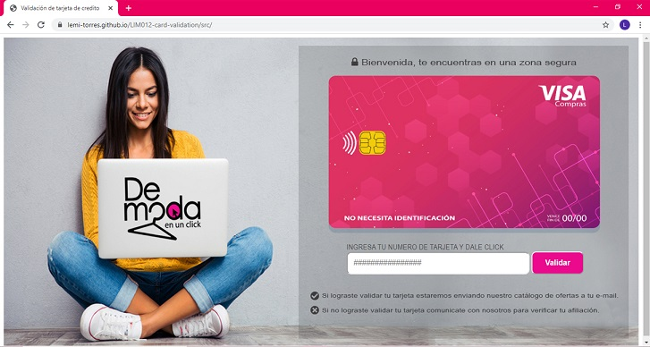
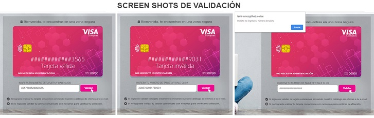
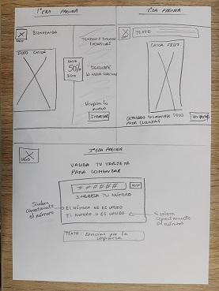
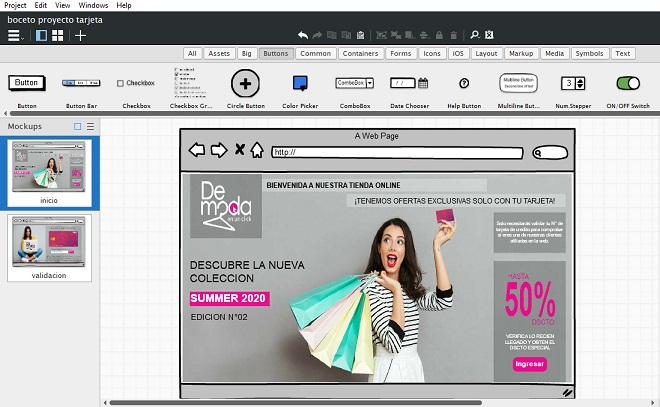
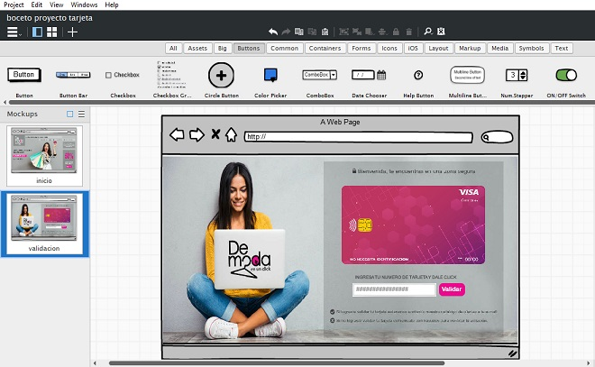

# PROYECTO : Tarjeta de crédito válida

:) TÍTULO: DeModa en un click 

:) RESUMEN DEL PROYECTO:

Mi pagina pertenece a una tienda de ropa online la cual permite a sus clientas afiliadas en la web acceder a sus catalogos de ofertas teniendo solo que validar su número de tarjeta de credito,el cual es una condicion principal de la tienda ya que por medio de ello podran realizar sus compras online.

:) IMAGEN FINAL DEL PROYECTO:

Pagina Inicio.

Pagina Validación.

Pagina Validación-Funcionalidad.

## INVESTIGACIÓN UX:

 1. Quiénes son los principales usuarios de producto.

 Son mujeres DE 20 años a más amantes de la moda que cuentan con una tarjeta de credito para realizar compras.

 2. Cuáles son los objetivos de estos usuarios en relación con tu producto.

 Ingresar con confianza datos de su tarjeta en una pagina que almacene de manera segura esos datos.
 Poder comprar ropa desde la comodidad de su casa.
 Demostrar que son clientas de la tienda solo validando su número de tarjeta pudiendo asi acceder a revistas de dsctos  evitando llenar demasiados datos y perder el tiempo en ello.
 Facilidad de uso y sin complicaciones en la validacion de tarjeta.

 3. Cómo crees que el producto que estás creando está resolviendo sus problemas.

 Mi producto no te obliga a hacer una compra de manera inmediata.
 Te permite acceder a un catalogo de ofertas exclusivas, y para ello solo te toma un minimo de tiempo poder validar tu tarjeta y lograr acceder a esos beneficios sin mucho tramite.

 4. FOTO DE MI PRIMER PROTOTIPO EN PAPEL

 

 5. RESUMEN DE FEEDBACK RECIBIDO:

 Mis compañeras de squad me comentaron que debia reducir la cantidad de texto y mostrar mas imagen y que no era necesario mostrar muchas paginas innecesarias,con una introducción y la pagina de validacion era suficiente.

 6. IMAGEN DEL PROTOTIPO FINAL:

 Pagina Inicio.
 

 Pagina Validación.
 

## 3. Objetivos de aprendizaje

Objetivos que he llegado a **entender** y
**aplicar** en mi proyecto.

### UX

* [X] [Diseñar la aplicación pensando y entendiendo al usuario](https://lms.laboratoria.la/cohorts/lim-2020-01-bc-core-lim012/courses/intro-ux/01-el-proceso-de-diseno/00-el-proceso-de-diseno)
* [X] [Crear prototipos para obtener feedback e iterar](https://lms.laboratoria.la/cohorts/lim-2020-01-bc-core-lim012/courses/product-design/00-sketching/00-sketching)
* [X] [Aplicar los principios de diseño visual](https://lms.laboratoria.la/cohorts/lim-2020-01-bc-core-lim012/courses/product-design/01-visual-design/01-visual-design-basics)

### HTML y CSS

* [X] [Uso correcto de HTML semántico](https://developer.mozilla.org/en-US/docs/Glossary/Semantics#Semantics_in_HTML)
* [X] [Uso de selectores de CSS](https://developer.mozilla.org/es/docs/Web/CSS/Selectores_CSS)
* [X] [Construir tu aplicación respetando el diseño realizado](https://lms.laboratoria.la/cohorts/lim-2020-01-bc-core-lim012/courses/css/01-css/02-boxmodel-and-display) (maquetación).

### DOM

* [X] [Uso de selectores de nodos del DOM](https://lms.laboratoria.la/cohorts/lim-2020-01-bc-core-lim012/courses/browser/02-dom/03-1-dom-methods-selection)
* [X] [Manejo de eventos del DOM](https://lms.laboratoria.la/cohorts/lim-2020-01-bc-core-lim012/courses/browser/02-dom/04-events)
* [ ] [Manipulación dinámica del DOM](https://developer.mozilla.org/es/docs/Referencia_DOM_de_Gecko/Introducci%C3%B3n)

### Javascript

* [X] [Manipulación de strings](https://lms.laboratoria.la/cohorts/lim-2020-01-bc-core-lim012/courses/javascript/06-strings/01-strings)
* [X] [Uso de condicionales](https://lms.laboratoria.la/cohorts/lim-2020-01-bc-core-lim012/courses/javascript/02-flow-control/01-conditionals-and-loops)
* [X] [Uso de bucles](https://lms.laboratoria.la/cohorts/lim-2020-01-bc-core-lim012/courses/javascript/02-flow-control/02-loops)
* [X] [Uso de funciones](https://lms.laboratoria.la/cohorts/lim-2019-09-bc-core-lim011/courses/javascript/02-flow-control/03-functions)
* [ ] [Datos atómicos y estructurados](https://www.todojs.com/tipos-datos-javascript-es6/)
* [ ] Utilizar ES Modules (`import` | `export`).

### Testing

* [ ] [Testeo de tus funciones](https://jestjs.io/docs/es-ES/getting-started)

### Git y GitHub

* [X] [Comandos de git](https://lms.laboratoria.la/cohorts/lim-2019-09-bc-core-lim011/courses/scm/01-git/04-commands)
  (`add` | `commit` | `pull` | `status` | `push`).
* [X] [Manejo de repositorios de GitHub](https://lms.laboratoria.la/cohorts/lim-2019-09-bc-core-lim011/courses/scm/02-github/01-githubhttps://lms.laboratoria.la/cohorts/lim-2019-09-bc-core-lim011/courses/scm/02-github/01-github)  (`clone` | `fork` | `gh-pages`).

### Buenas prácticas de desarrollo

* [X] Organizar y dividir el código en módulos (Modularización).
* [X] Uso de identificadores descriptivos (Nomenclatura | Semántica).
* [X] Uso de linter para seguir buenas prácticas (ESLINT).

Proyecto terminado :)